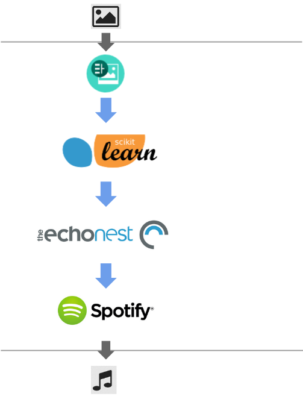

# [Onpasha](http://hacklog.jp/works/3391) API Server

Onpasha converts image to song.



* Convert image to [Gracenote](https://developer.gracenote.com/ja/web-api?language=ja)'s mood by scikit-learn
* Get artists info from [LiveFans](http://www.livefans.jp/)
* Get tracks by mood and artists (Gracenote).
* Get track's lyric by [PetitLyrics](http://petitlyrics.com/)
* Build new Lyric from it.
* Convert lyric to song by [YAMAHA VOCALODUCER](http://jp.yamaha.com/news_release/2013/13102104.html)
* ([Pepper](http://www.softbank.jp/robot/special/pepper/) sings a song)
* (Share songs by [SendGrid](https://sendgrid.kke.co.jp/))

Now, you can here your photo image!

## Setting

Please prepare the `environ.yaml` at the project root.

```
yamaha_key: your_key
yamaha_ver: your_key
rekognition_key: your_key
rekognition_secret: your_key
gracenote_client_id: your_key
gracenote_user_id: your_key
livefan_client_id: your_key
petitlyrics_auth_key: your_key
```
